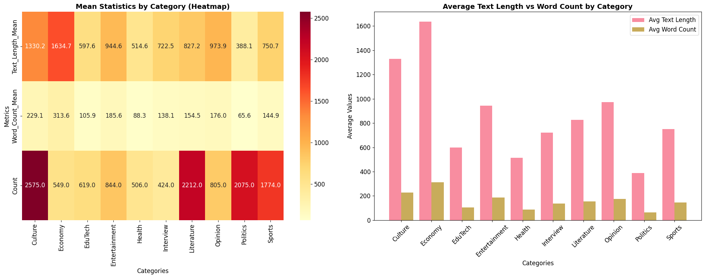

# DATA Viz

# Text data
```
TEXT STATISTICS:
  Total Characters: 96,601,554
  Devanagari Characters: 74,128,806
  Words: 17,592,363
  Lines: 45,503
```


## Label Classes data

### Sanple
```Json
{'text': 'शीतलं निर्मलं तोयं कर्पूरेण सुवासितम्। आचम्यतां जलं ह्येतत् प्रसीद परमेश्वरि॥ ॐ महालक्ष्म्यै नम:, आचमनीयं जलं समर्पयामि। (नैवेद्य निवेदन करबाक बाक आचमन लेल जल दी।)', 'labels': 'Culture'}
```

### Distribution

```
Label Distribution:
labels
Culture          2575
Literature       2212
Politics         2075
Sports           1774
Entertainment     844
Opinion           805
EduTech           619
Economy           549
Health            506
```





============================================================
# MODEL COMPARISON SUMMARY
============================================================

## ML Model
```
                     accuracy  cv_accuracy
SVM (Linear)         0.766963     0.756263
SVM (RBF)            0.757270     0.746465
Logistic Regression  0.749192     0.737071
Random Forest        0.656300     0.648283
Naive Bayes          0.645800     0.633434
K-Nearest Neighbors  0.211228     0.191515
```
## NN
```
NeuralNetwork(
  (fc1): Linear(in_features=5000, out_features=512, bias=True)
  (bn1): BatchNorm1d(512, eps=1e-05, momentum=0.1, affine=True, track_running_stats=True)
  (dropout1): Dropout(p=0.3, inplace=False)
  (fc2): Linear(in_features=512, out_features=256, bias=True)
  (bn2): BatchNorm1d(256, eps=1e-05, momentum=0.1, affine=True, track_running_stats=True)
  (dropout2): Dropout(p=0.3, inplace=False)
  (fc3): Linear(in_features=256, out_features=128, bias=True)
  (bn3): BatchNorm1d(128, eps=1e-05, momentum=0.1, affine=True, track_running_stats=True)
  (dropout3): Dropout(p=0.2, inplace=False)
  (fc4): Linear(in_features=128, out_features=64, bias=True)
  (dropout4): Dropout(p=0.2, inplace=False)
  (fc5): Linear(in_features=64, out_features=10, bias=True)
)

Total parameters: 2,735,434
Trainable parameters: 2,735,434
```
```
Test Accuracy: 72.62%
Test Loss: 0.7879

Classification Report:
               precision    recall  f1-score   support

      Culture       0.73      0.72      0.73       515
      Economy       0.68      0.83      0.75       110
      EduTech       0.44      0.32      0.37       124
Entertainment       0.62      0.70      0.66       169
       Health       0.59      0.48      0.53       101
    Interview       0.92      0.67      0.78        85
   Literature       0.66      0.78      0.72       441
      Opinion       0.74      0.68      0.71       161
     Politics       0.82      0.83      0.83       415
       Sports       0.85      0.77      0.81       355

     accuracy                           0.73      2476
    macro avg       0.71      0.68      0.69      2476
 weighted avg       0.73      0.73      0.72      2476
 ```

## RNN-LSTM-Classfier
```
Model: RNNLSTMClassifier(
  (embedding): Embedding(100, 128, padding_idx=0)
  (rnn): RNN(128, 256, num_layers=2, batch_first=True, dropout=0.3)
  (lstm): LSTM(256, 256, num_layers=2, batch_first=True, dropout=0.3)
  (dropout): Dropout(p=0.3, inplace=False)
  (classifier): Sequential(
    (0): Linear(in_features=256, out_features=128, bias=True)
    (1): ReLU()
    (2): Dropout(p=0.3, inplace=False)
    (3): Linear(in_features=128, out_features=10, bias=True)
  )
)
```
```
Test Set Evaluation:
Test Accuracy: 0.5525 (55.25%)

Classification Report:
               precision    recall  f1-score   support

      Culture       0.64      0.53      0.58       515
      Economy       0.66      0.19      0.30       110
      EduTech       0.00      0.00      0.00       124
Entertainment       0.37      0.36      0.36       169
       Health       0.00      0.00      0.00       101
    Interview       0.72      0.42      0.53        85
   Literature       0.43      0.70      0.54       441
      Opinion       0.00      0.00      0.00       161
     Politics       0.59      0.91      0.72       415
       Sports       0.65      0.82      0.72       355

     accuracy                           0.55      2476
    macro avg       0.41      0.39      0.37      2476
 weighted avg       0.48      0.55      0.50      2476
 ```

 ## RNN-Attention Based

 ```
 Classification Report:
               precision    recall  f1-score   support

      Culture       0.73      0.72      0.72       515
      Economy       0.51      0.37      0.43       110
      EduTech       0.42      0.17      0.24       124
Entertainment       0.48      0.41      0.44       169
       Health       0.54      0.28      0.37       101
    Interview       0.76      0.64      0.69        85
   Literature       0.69      0.73      0.71       441
      Opinion       0.78      0.67      0.72       161
     Politics       0.68      0.86      0.76       415
       Sports       0.64      0.80      0.71       355

     accuracy                           0.67      2476
    macro avg       0.62      0.56      0.58      2476
 weighted avg       0.66      0.67      0.65      2476


Final Validation Accuracy: 0.6684
```
### RNN-Ateention and Byte level tokenizer

```

Classification Report:
               precision    recall  f1-score   support

      Culture       0.67      0.48      0.56       515
      Economy       0.00      0.00      0.00       110
      EduTech       0.00      0.00      0.00       124
Entertainment       0.04      0.01      0.01       169
       Health       0.00      0.00      0.00       101
    Interview       0.00      0.00      0.00        85
   Literature       0.41      0.56      0.47       441
      Opinion       0.45      0.14      0.22       161
     Politics       0.38      0.75      0.51       415
       Sports       0.46      0.78      0.58       355

     accuracy                           0.45      2476
    macro avg       0.24      0.27      0.23      2476
 weighted avg       0.37      0.45      0.38      2476


Final Validation Accuracy: 0.4475
```

### same above with words lebel tokenizer

```
Classification Report:
               precision    recall  f1-score   support

      Culture       0.00      0.00      0.00       515
      Economy       0.00      0.00      0.00       110
      EduTech       0.00      0.00      0.00       124
Entertainment       0.00      0.01      0.00       169
       Health       0.00      0.00      0.00       101
    Interview       0.00      0.00      0.00        85
   Literature       0.00      0.00      0.00       441
      Opinion       0.00      0.00      0.00       161
     Politics       0.00      0.00      0.00       415
       Sports       0.16      1.00      0.28       355

     accuracy                           0.14      2476
    macro avg       0.02      0.10      0.03      2476
 weighted avg       0.02      0.14      0.04      2476


Final Validation Accuracy: 0.1434
```
